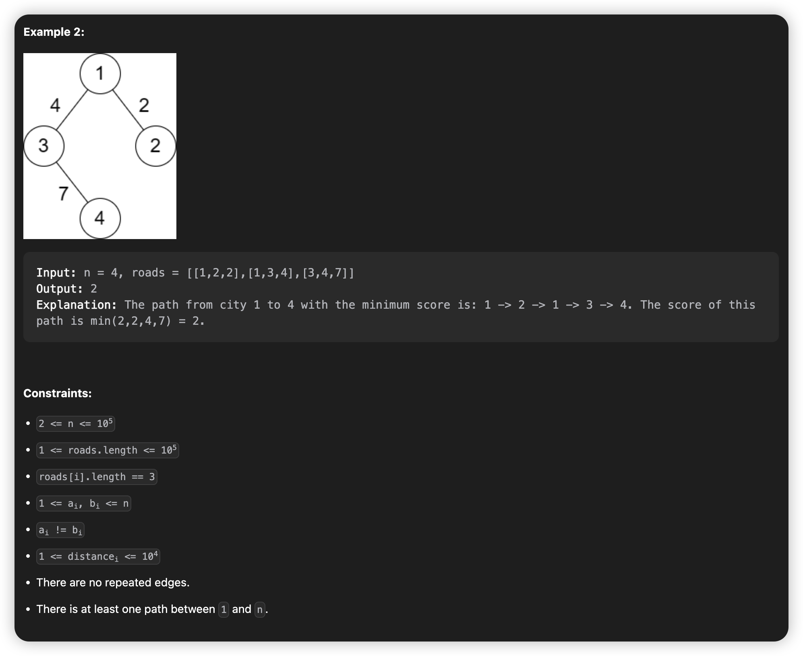
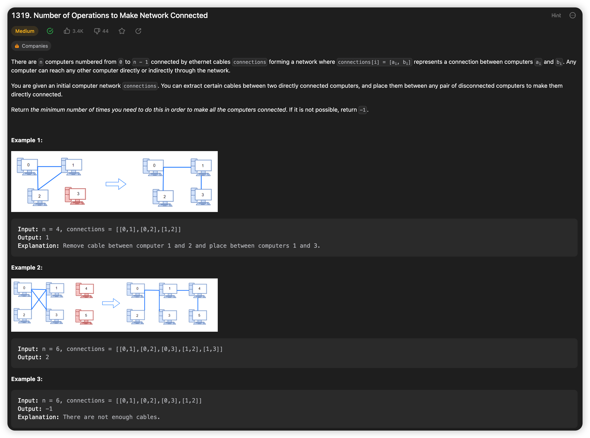
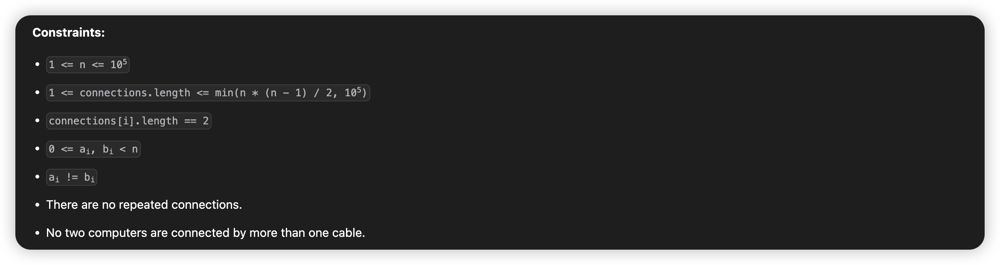

# March, 2023
|Mon|Tue|Wed|Thu|Fri|Sat|Sun|
|-|-|-|-|-|-|-|
|20|21|22|23|24|25|26|
## **Problem List**
|problemID|name|difficulty|lastChange|status|time complexity|beat|comment|recorded|
|-|-|-|-|-|-|-|-|-|
|605|Can Place Flowers|Easy|03/20/2023|AC|O(n)|100%||N|
|2348|Number of Zero-Filled Subarrays|Medium|03/21/2023|AC|O(n)|99.7%||N|
|2492|Minimum Score of a Path Between Two Cities|Medium|03/20/2023|AT|||graph,dfs|Y|
|1319|Number of Operations to Make Network Connected|Medium|03/23/2023|AC|O(n^2)|58.6%|count branches of graph,dfs|Y|
|1466|Reorder Routes to Make All Paths Lead to the City Zero|Medium|03/24/2023||||||

## 2492. Minimum Score of a Path Between Two Cities
> dfs   
> 03/23/2023




## 1319. Number of Operations to Make Network Connected
> count number of branches, dfs O(n^2)
> 03/23/2023




### **Solution**

Use array of list (scattered list) torecord a graph, notice that this is an primary undirected graph, with no self-circle and duplicated edges.
Deep-first-search. Use an array 'visit' to record whether a point is visited. When find an unvisited vertex, means its an new branch, then use dfs to visit every vertex of this branch.

### **Java**
```java {.line-numbers}
class Solution {
    private List<Integer>[] G;
    private boolean[] visit;
    public int makeConnected(int n, int[][] connections) {
        if(connections.length < n - 1) return -1;
        G = new List[n];
        for(int i = 0; i < n; ++i) {
            G[i] = new LinkedList<>();
        }
        for(int i = 0; i < connections.length; ++i) {
            G[connections[i][0]].add(connections[i][1]);
            G[connections[i][1]].add(connections[i][0]);
        }

        visit = new boolean[n];
        int count = 0;
        for(int i = 0; i < n; ++i) {
            if(!visit[i]) {
                ++count;
                dfs(i);
            }
        }
        return count - 1;
    }

    public void dfs(int i) {
        if(!visit[i]) {
            visit[i] = true;
            Iterator<Integer> it = G[i].iterator();
            while(it.hasNext()) {
                dfs(it.next());
            }
        }else {
            return;
        }
    }
}
```