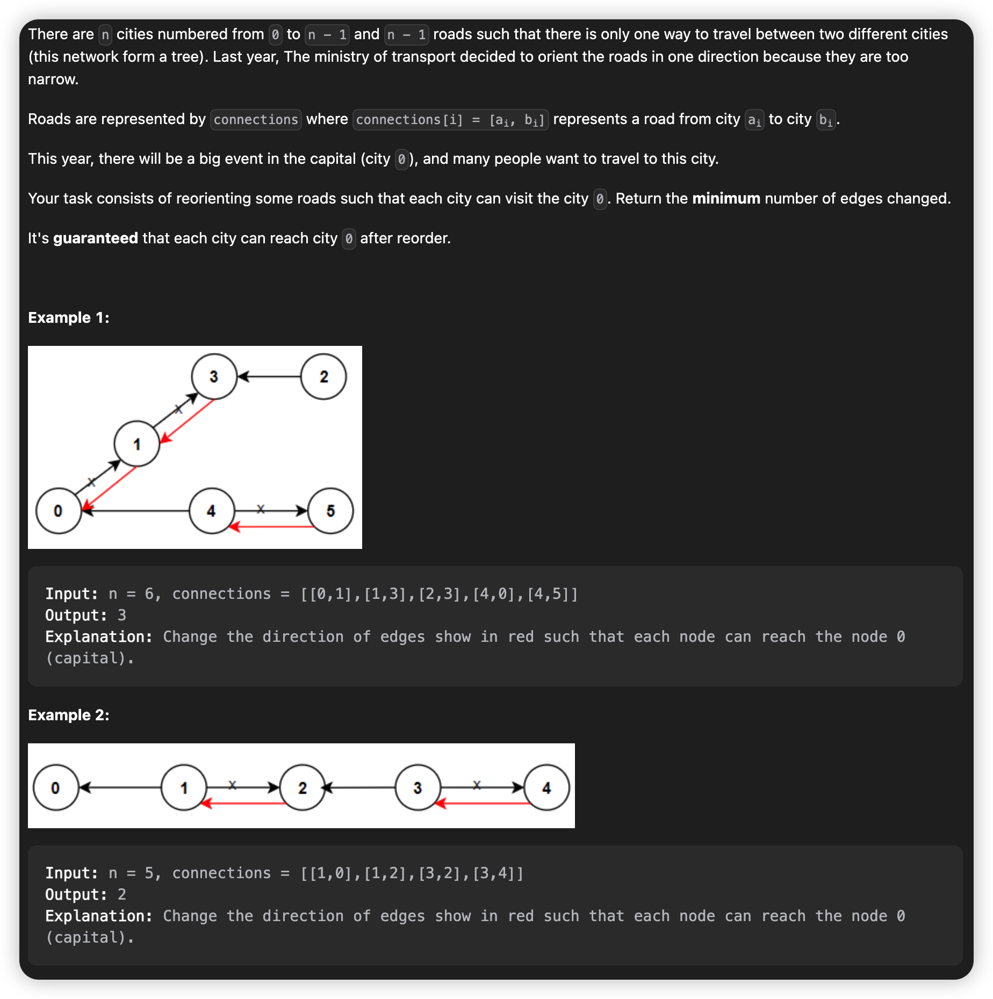
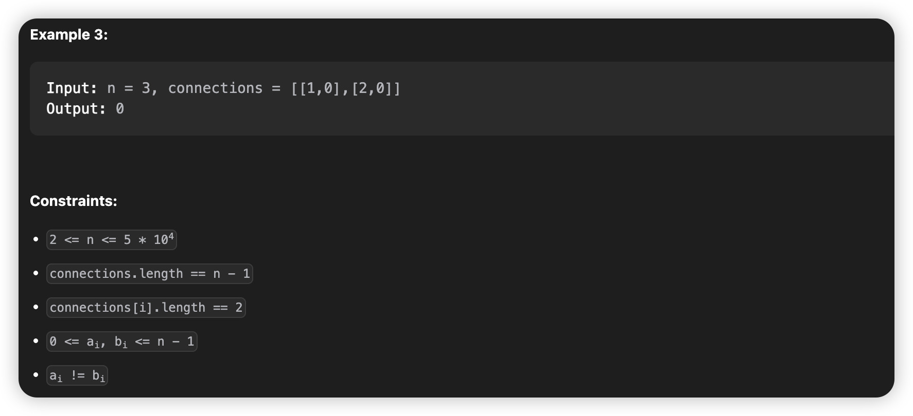
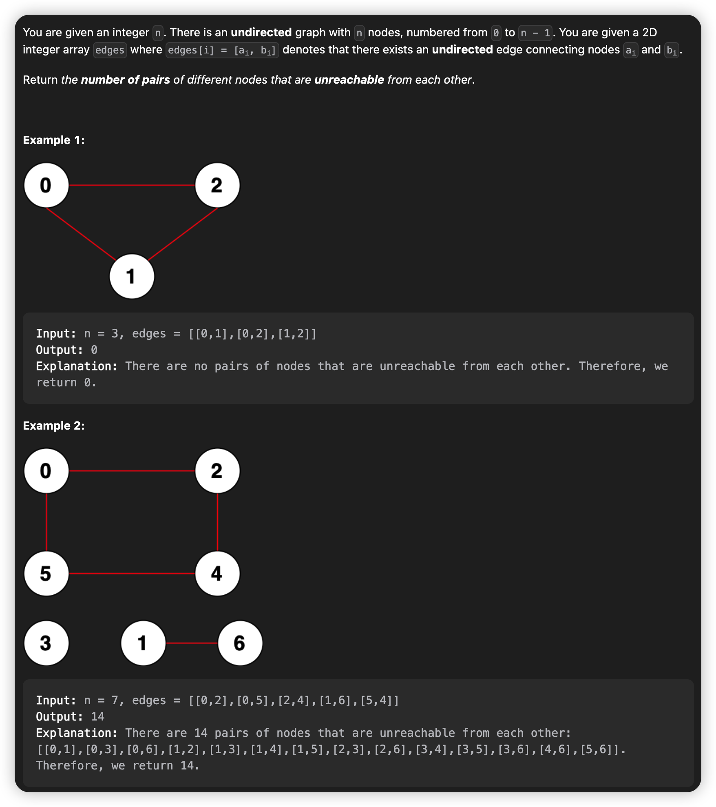
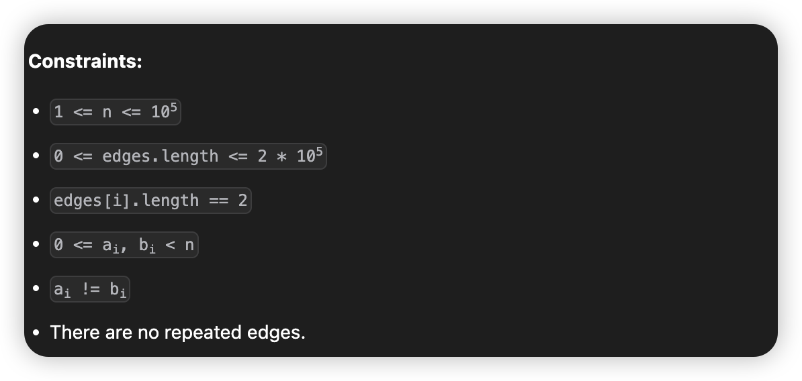

# March, 2023
|Mon|Tue|Wed|Thu|Fri|Sat|Sun|
|-|-|-|-|-|-|-|
|20|21|22|23|24|25|26|
## **Problem List**
|problemID|name|difficulty|lastChange|status|time complexity|beat|comment|recorded|
|-|-|-|-|-|-|-|-|-|
|605|Can Place Flowers|Easy|03/20/2023|AC|O(n)|100%||N|
|2348|Number of Zero-Filled Subarrays|Medium|03/21/2023|AC|O(n)|99.7%||N|
|2492|Minimum Score of a Path Between Two Cities|Medium|03/20/2023|AT|||graph,dfs|Y|
|1319|Number of Operations to Make Network Connected|Medium|03/23/2023|AC|O(n^2)|58.6%|count branches of graph,dfs|Y|
|1466|Reorder Routes to Make All Paths Lead to the City Zero|Medium|03/24/2023|AC|O(n)|66.5%|dfs, tree|Y|
|2316|Count Unreachable Pairs of Nodes in an Undirected Graph|Medium|03/25/2023|AC|O(n)|34.1%|dfs, graph|Y|
|2360|Longest Cycle in a Graph|Hard|03/26/2023|||||Y|

## 2492. Minimum Score of a Path Between Two Cities
> dfs   
> 03/23/2023


## 1319. Number of Operations to Make Network Connected
> count number of branches, dfs O(n^2)
> 03/23/2023


### **Solution**

Use array of list (scattered list) torecord a graph, notice that this is an primary undirected graph, with no self-circle and duplicated edges.
Deep-first-search. Use an array 'visit' to record whether a point is visited. When find an unvisited vertex, means its an new branch, then use dfs to visit every vertex of this branch.

### **Java**
```java {.line-numbers}
class Solution {
    private List<Integer>[] G;
    private boolean[] visit;
    public int makeConnected(int n, int[][] connections) {
        if(connections.length < n - 1) return -1;
        G = new List[n];
        for(int i = 0; i < n; ++i) {
            G[i] = new LinkedList<>();
        }
        for(int i = 0; i < connections.length; ++i) {
            G[connections[i][0]].add(connections[i][1]);
            G[connections[i][1]].add(connections[i][0]);
        }

        visit = new boolean[n];
        int count = 0;
        for(int i = 0; i < n; ++i) {
            if(!visit[i]) {
                ++count;
                dfs(i);
            }
        }
        return count - 1;
    }

    public void dfs(int i) {
        if(!visit[i]) {
            visit[i] = true;
            Iterator<Integer> it = G[i].iterator();
            while(it.hasNext()) {
                dfs(it.next());
            }
        }else {
            return;
        }
    }
}
```

## 1466. Reorder Routes to Make All Paths Lead to the City Zero
> graph dfs
> AC 03/24/2023 O(n)




## **Solution**

Notice there are `n-1` roads, and no self-circle or duplicated edges, and connected, means its a simple graph and tree.   
It's intuitively to assume that city 0 is the root of this tree. And we search the tree with dfs, find each edge leading from parent to child, reverse it. After all the operations, we get a tree with city 0 as root, and each edge leading from child to parent, that just meets the demands of this problem.   
So we just need to count the number of edges leading from parent to child in this tree, which is the answer.

## Java
```java {.line-numbers}
class Node {
    int idx;
    boolean in;

    public Node(int idx, boolean in) {
        this.idx = idx;
        this.in = in;
    }
}

class Solution {
    List<Node>[] G;
    boolean[] visit;
    int cnt;
    public int minReorder(int n, int[][] connections) {
        G = new List[n];
        visit = new boolean[n];
        for(int i = 0; i < n; ++i) {
            G[i] = new LinkedList<>();
        }
        for(int i = 0; i < connections.length; ++i) {
            int a = connections[i][0];
            int b = connections[i][1];
            G[a].add(new Node(b, true));
            G[b].add(new Node(a, false));
        }
        dfs(0);
        return cnt;
    }

    public void dfs(int idx) {
        if(visit[idx]) return;
        visit[idx] = true;
        Iterator<Node> it = G[idx].iterator();
        while(it.hasNext()) {
            Node node = it.next();
            if(visit[node.idx] == false) {
                // System.out.println("---");
                // System.out.println(node.idx);
                // System.out.println("---");
                // System.out.println(cnt);
                // System.out.println("---");
                cnt = node.in ? cnt + 1 : cnt;
                // System.out.println(cnt);
                // System.out.println("---");
            }
            dfs(node.idx);
            visit[node.idx] = true;
            // System.out.println("****");
            // System.out.println(node.idx);
        }
        return;
    }
}
```
## 2316. Count Unreachable Pairs of Nodes in an Undirected Graph
> dfs graph   
> AC 03/26/2023 O(n)




## **Solution**
* Each Unreachable pair of nodes belong to different branch in the graph. So the problem converts to counting number of vertexs in each branch. Then calculate the sum of all two products, which is the answer.
* To calculate number of vertexs in each branch, you need to dfs the whole graph, which is saved in scattered list.
* Notice the final answer may exceed the range of `int` (-2^31 to 2^31 - 1). Use long rather than int to store the answer.

## **Java**
```java  {.line-numbers}
class Solution {
    List<Integer>[] G;
    List<Integer> branches;
    boolean[] visit;
    int cnt;
    public long countPairs(int n, int[][] edges) {
        G = new List[n];
        branches = new LinkedList<>();
        visit = new boolean[n];
        for(int i = 0; i < n; ++i) {
            G[i] = new LinkedList<>();
        }
        for(int i = 0; i < edges.length; ++i) {
            int a = edges[i][0];
            int b = edges[i][1];
            G[a].add(b);
            G[b].add(a);
        }

        for(int i = 0; i < n; ++i) {
            if(!visit[i]) {
                dfs(i);
                branches.add(cnt);
                cnt = 0;
            }
        }

        // System.out.println("branches.size");
        // System.out.println(branches.size());
        int num = branches.size();
        if(num == 1) return 0;

        int[] branch = new int[num];
        Iterator<Integer> it = branches.iterator();
        int idx = 0;
        while(it.hasNext()) {
            branch[idx] = it.next();
            ++idx;
        }

        long sum = (long)(n) * (long)(n - 1) / 2;
        for(int i = 0; i < num; ++i) {
            sum -= (long)(branch[i]) * (long)(branch[i] - 1) / 2;
        }
        return sum;
    }

    public void dfs(int i) {
        if(visit[i]) return;
        visit[i] = true;
        cnt += 1;
        Iterator<Integer> it = G[i].iterator();
        while(it.hasNext()) {
            int cur = it.next();
            if(!visit[cur]) {
                // System.out.println("cur");
                // System.out.println(i);
                // System.out.println(cur);
                dfs(cur);
            }
        }
    }
}
```
## 2360. Longest Cycle in a Graph