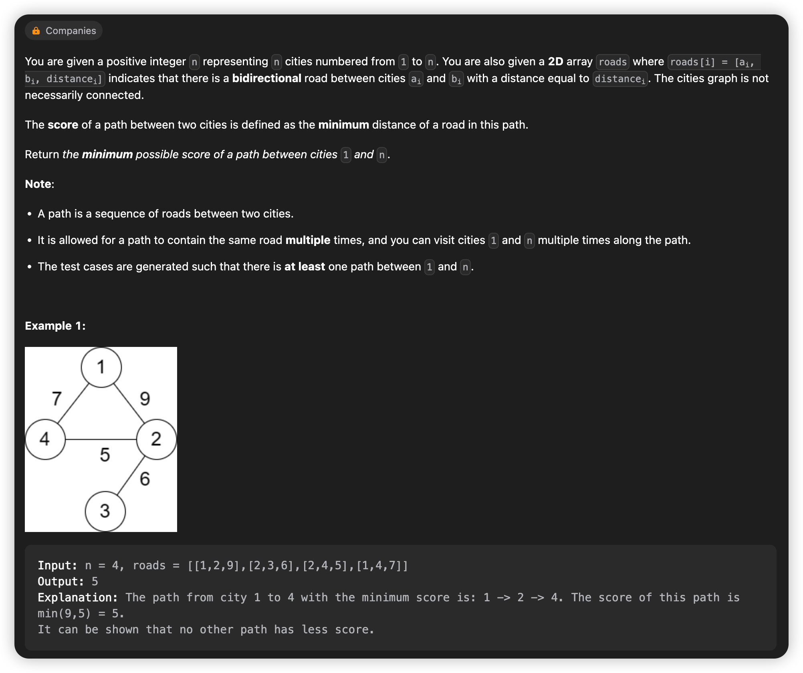

# March, 2023
|Mon|Tue|Wed|Thu|Fri|Sat|Sun|
|-|-|-|-|-|-|-|
|20|21|22|23|24|25|26|
## **Problem List**
|problemID|name|difficulty|lastChange|status|time complexity|beat|comment|recorded|
|-|-|-|-|-|-|-|-|-|
|605|Can Place Flowers|Easy|03/20/2023|AC|O(n)|100%||N|
|2348|Number of Zero-Filled Subarrays|Medium|03/21/2023|AC|O(n)|99.7%||N|
|2492|Minimum Score of a Path Between Two Cities|Medium|03/20/2023|AT|||graph,dfs|Y|
|1319|Number of Operations to Make Network Connected|Medium|03/23/2023|AC|O(n^2)|58.6%|count branches of graph,dfs|Y|
|1466|Reorder Routes to Make All Paths Lead to the City Zero|Medium|03/24/2023|AC|O(n)|66.5%|dfs, tree|Y|

## 2492. Minimum Score of a Path Between Two Cities
> dfs   
> 03/23/2023




## 1319. Number of Operations to Make Network Connected
> count number of branches, dfs O(n^2)
> 03/23/2023


### **Solution**

Use array of list (scattered list) torecord a graph, notice that this is an primary undirected graph, with no self-circle and duplicated edges.
Deep-first-search. Use an array 'visit' to record whether a point is visited. When find an unvisited vertex, means its an new branch, then use dfs to visit every vertex of this branch.

### **Java**
```java {.line-numbers}
class Solution {
    private List<Integer>[] G;
    private boolean[] visit;
    public int makeConnected(int n, int[][] connections) {
        if(connections.length < n - 1) return -1;
        G = new List[n];
        for(int i = 0; i < n; ++i) {
            G[i] = new LinkedList<>();
        }
        for(int i = 0; i < connections.length; ++i) {
            G[connections[i][0]].add(connections[i][1]);
            G[connections[i][1]].add(connections[i][0]);
        }

        visit = new boolean[n];
        int count = 0;
        for(int i = 0; i < n; ++i) {
            if(!visit[i]) {
                ++count;
                dfs(i);
            }
        }
        return count - 1;
    }

    public void dfs(int i) {
        if(!visit[i]) {
            visit[i] = true;
            Iterator<Integer> it = G[i].iterator();
            while(it.hasNext()) {
                dfs(it.next());
            }
        }else {
            return;
        }
    }
}
```

## 1466. Reorder Routes to Make All Paths Lead to the City Zero
> graph dfs
> AC 03/24/2023 O(n)


## **Solution**

Notice there are n-1 roads, and no self-circle or duplicated edges, and connected, means its a simple graph and tree.   
It's intuitively to assume that city 0 is the root of this tree. And we search the tree with dfs, find each edge leading from parent to child, reverse it. After all the operations, we get a tree with city 0 as root, and each edge leading from child to parent, that just meets the demands of this problem.   
So we just need to count the number of edges leading from parent to child in this tree, which is the answer.

## Java
```java {.line-numbers}
class Node {
    int idx;
    boolean in;

    public Node(int idx, boolean in) {
        this.idx = idx;
        this.in = in;
    }
}

class Solution {
    List<Node>[] G;
    boolean[] visit;
    int cnt;
    public int minReorder(int n, int[][] connections) {
        G = new List[n];
        visit = new boolean[n];
        for(int i = 0; i < n; ++i) {
            G[i] = new LinkedList<>();
        }
        for(int i = 0; i < connections.length; ++i) {
            int a = connections[i][0];
            int b = connections[i][1];
            G[a].add(new Node(b, true));
            G[b].add(new Node(a, false));
        }
        dfs(0);
        return cnt;
    }

    public void dfs(int idx) {
        if(visit[idx]) return;
        visit[idx] = true;
        Iterator<Node> it = G[idx].iterator();
        while(it.hasNext()) {
            Node node = it.next();
            if(visit[node.idx] == false) {
                // System.out.println("---");
                // System.out.println(node.idx);
                // System.out.println("---");
                // System.out.println(cnt);
                // System.out.println("---");
                cnt = node.in ? cnt + 1 : cnt;
                // System.out.println(cnt);
                // System.out.println("---");
            }
            dfs(node.idx);
            visit[node.idx] = true;
            // System.out.println("****");
            // System.out.println(node.idx);
        }
        return;
    }
}
```