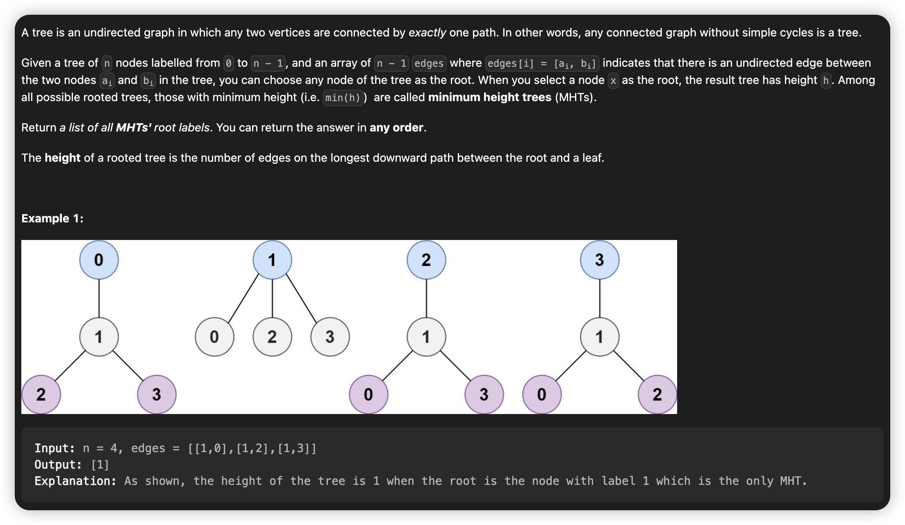
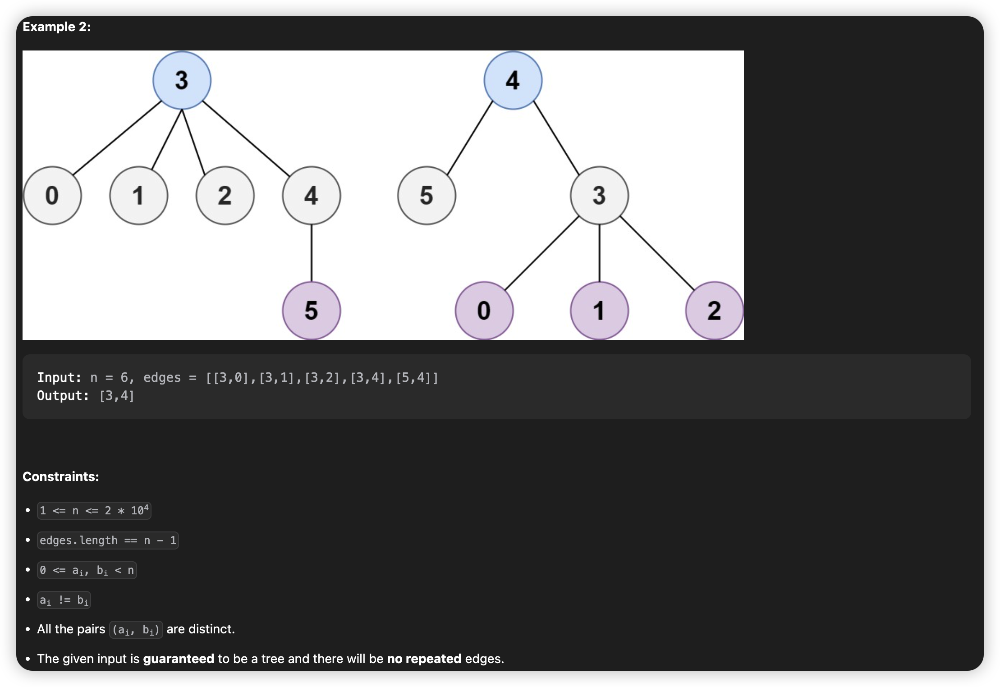
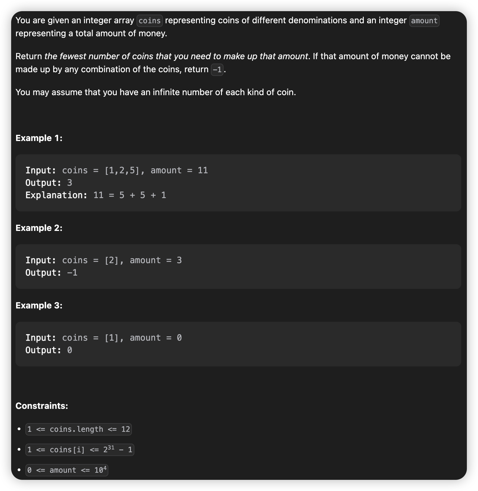
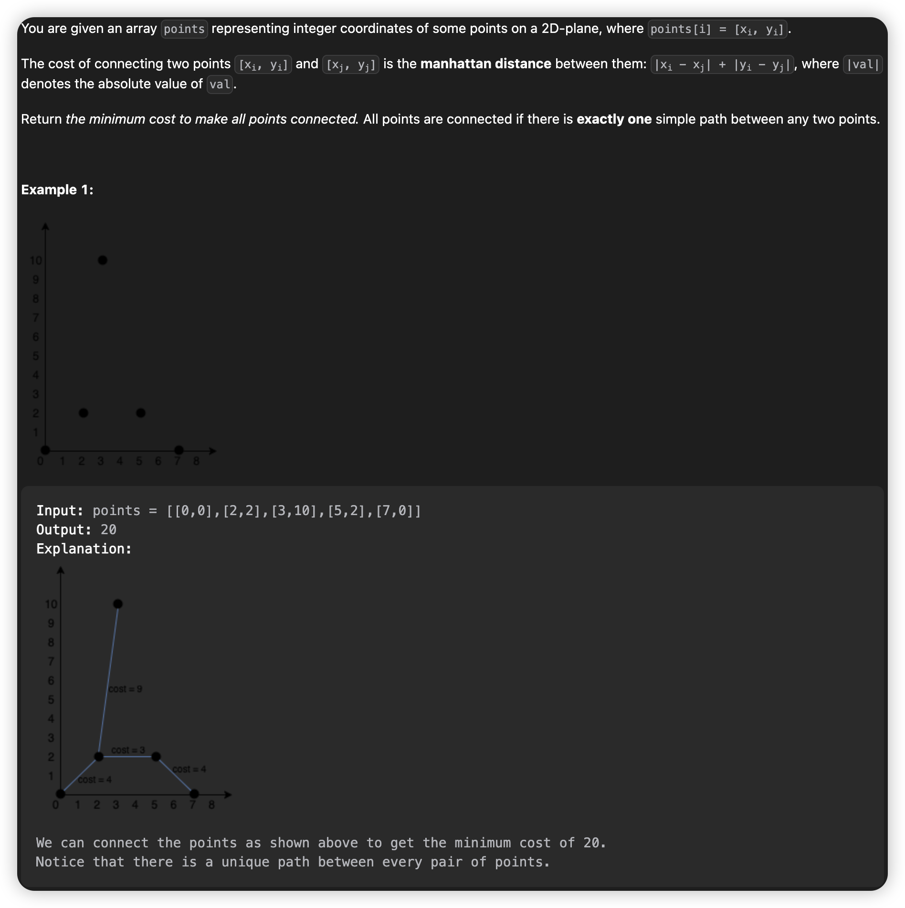
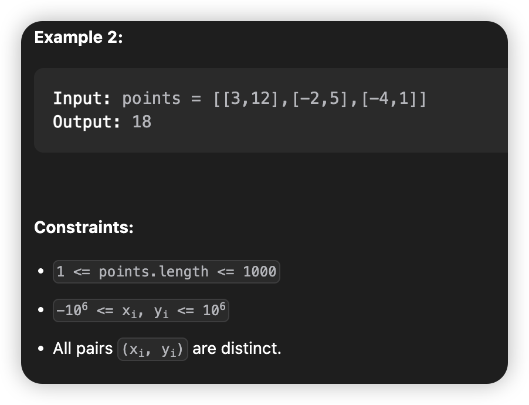
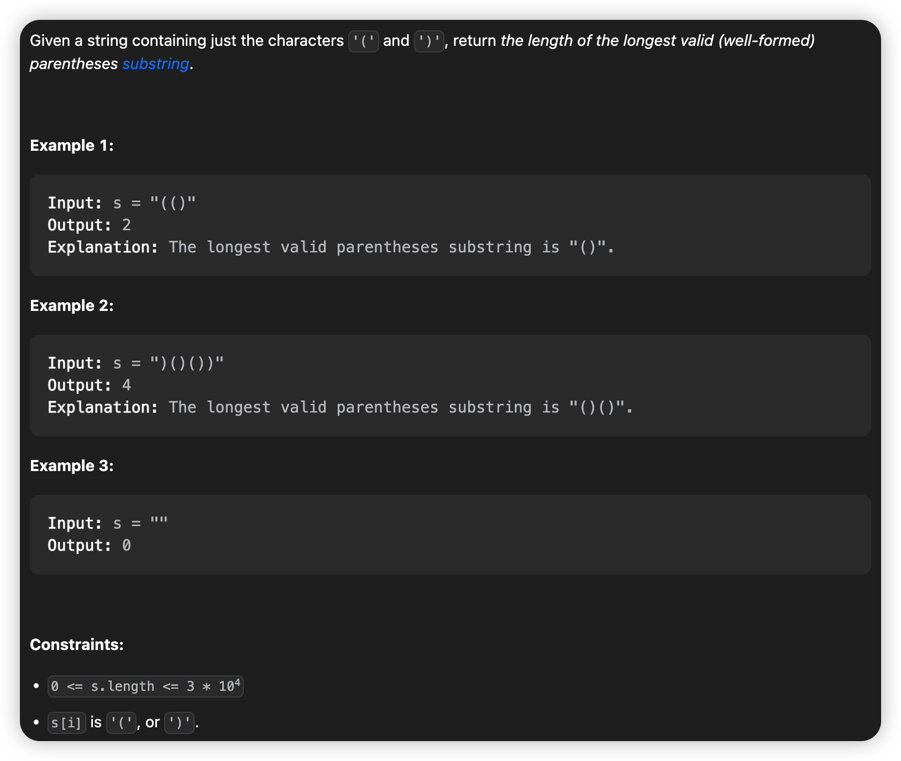

# March, 2023
|Mon|Tue|Wed|Thu|Fri|Sat|Sun|
|-|-|-|-|-|-|-|
|27|28|29|30|31|1|2|

## **Problem List**
|problemID|name|difficulty|lastChange|status|time complexity|beat|comment|recorded|
|-|-|-|-|-|-|-|-|-|
|64|Minimum Path Sum|Medium|03/27/2023|AC|O(m*n)|99%|DP|Y|
|310|Minimum Height Trees|Medium|03/27/2023|AC|O(n)|96%|Graph|Y|
|983|Minimum Cost For Tickets|Medium|03/28/2023|AC|O(n)|77%|dp|Y|
|322|Coin Change|Medium|03/28/2023|AC|O(n)|70%|dp|Y|
|1402|Reducing Dishes|Hard|03/29/2023|AC|O(n)|65.0%|shouldnt be 'hard'|N|
|1584|Min Cost to Connect All Points|Medium|03/29/2023|AC|O(n^2)|72.8%|prim|Y|
|87|Scramble String|Hard|03/30/2023|||||Y|
|32|Longest Valid Parentheses|Hard|04/01/2023|AC|O(n)|24.5%|stack|Y|

## 64. Minimum Path Sum
> DP AC 03/27/2023   


### **Solution**

* Typical dynamic programming problem, time complexity O(m * n), space complexity O(n).

### **Java**
```java {.line-numbers}
class Solution {
    public int minPathSum(int[][] grid) {
        int m = grid.length;
        int[] cur = grid[0];
        int n = cur.length;
        int[] pre = new int[n];
        for(int i = 1; i < n; ++i) {
            cur[i] += cur[i - 1];
            // System.out.println(cur[i]);
        }
        System.arraycopy(cur, 0, pre, 0, n);
        for(int i = 1; i < m; ++i) {
            cur[0] = pre[0] + grid[i][0]; 
            for(int j = 1; j < n; ++j) {
                cur[j] = pre[j] < cur[j - 1] ? pre[j] + grid[i][j] : cur[j - 1] + grid[i][j];
                // System.out.println(cur[j]);
            }
            System.arraycopy(cur, 0, pre, 0, n);
        }
        return cur[n - 1];
    }
}
```

## 310. Minimum Height Trees
> AC 03/27




### **Solution**
* The main thought is to trim leave nodes. After trimming most leaves, the 'core' remaining inside (1 or 2 points) is what we want. 
* The python version 1 has time complexity of O(n^2), nearly passes all testcases(70/71). Maybe quicker if optimized.
* The time complexity can be optimized using set() to replace list when recording the graph with adjacent list, like python version 2.
only O(n) now.

### Python Version 1 (pass 70/71)
```python {.line-numbers}
class Solution:
    def findMinHeightTrees(self, n: int, edges: List[List[int]]) -> List[int]:
        if(n == 1): return [0]
        G = [[] for _ in range(n)]
        d = [0] * n
        for i in range(n - 1):
            a = edges[i][0]
            b = edges[i][1]
            d[a] += 1
            d[b] += 1
            G[a].append(b)
            G[b].append(a)

        rm = []
        remain = [True] * n
        while(True):
            for i in range(n):
                if(d[i] == 1):
                    rm.append(i)
                elif(d[i] == 0 and remain[i]):
                    rm.append(i)

            if(self.countRemain(remain) <= 2):
                return rm
            else:
                for node in rm:
                    d[node] -= 1
                    remain[node] = False
                    for x in G[node]:
                        d[x] -= 1
                rm = []
                
    def countRemain(self, remain) :
        sum = 0
        for x in remain:
            if(x): sum += 1
        return sum

```

### Python Version 2 [reference](https://leetcode.com/problems/minimum-height-trees/solutions/76055/share-some-thoughts/)
```python {.line-numbers}
class Solution:
    def findMinHeightTrees(self, n, edges):
        if n == 1: return [0] 
        adj = [set() for _ in range(n)]
        for i, j in edges:
            adj[i].add(j)
            adj[j].add(i)

        leaves = [i for i in range(n) if len(adj[i]) == 1]

        while n > 2:
            n -= len(leaves)
            newLeaves = []
            for i in leaves:
                j = adj[i].pop()
                adj[j].remove(i)
                if len(adj[j]) == 1: newLeaves.append(j)
            leaves = newLeaves
        return leaves
```

## 983. Minimum Cost For Tickets
> dp AC   

### **Solution**
A direct way is using recursion. However, it contains lots of duplicated calculation, like java version 1.
To apply the idea of dynamic planning, the key is designing array `dp`. Here `dp[i]` means the least cost to travel `i` days, which covers given days during `1` to `i`, specially `dp[0] = 0`. For example, if `days = [1]`, then `dp = [0,costs[0]]`.

### Java Version 1 (pass 26/69 TLE)
```java {.line-numbers}
class Solution {
    public int mincostTickets(int[] days, int[] costs) {
        if(days.length == 0) return 0;
        int bill1 = costs[0] + mincostTickets(Arrays.copyOfRange(days, getFrom(days, 1), days.length), costs);
        int bill2 = costs[1] + mincostTickets(Arrays.copyOfRange(days, getFrom(days, 2), days.length), costs);
        int bill3 = costs[2] + mincostTickets(Arrays.copyOfRange(days, getFrom(days, 3), days.length), costs);
        int bill = Math.min(bill1, Math.min(bill2, bill3));
        return bill;
    }

    public int getFrom(int[] days, int pass) { // pass = 1, 2, 3
        int n = days.length;
        int p = 0;
        if(pass == 1) {
            return 1;
        }else if(pass == 2) {
            while(p < n && days[p] < days[0] + 7) {
                ++p;
            }
            return p;
        }else {
            while(p < n && days[p] < days[0] + 30) {
                ++p;
            }
            return p;
        }
    }
}
```

### **Java Version 2** AC beat77%
```java {.line-numbers}
class Solution {
    public int mincostTickets(int[] days, int[] costs) {
        int n = days.length;
        int finalday = days[n - 1];
        int[] dp = new int[finalday + 1]; // dp[i] means the least cost to travel `i` days in the given list.
        dp[0] = 0;
        int pre = 0;
        for(int x : days) {
            for(int i = pre + 1; i < x; ++i) {
                dp[i] = dp[i - 1];
            }
            int bill1 = costs[0] + dp[x - 1];
            int bill2 = costs[1] + dp[Math.max(0, x - 7)];
            int bill3 = costs[2] + dp[Math.max(0, x - 30)];
            dp[x] = Math.min(bill1, Math.min(bill2, bill3));
            pre = x;
        }
        return dp[finalday];
    }
}
```

## 322. Coin Change
> dp AC 70% 03/28



## **Solution**
typical dp problem.

## **Java**
```java {.line-numbers}
class Solution {
    public int coinChange(int[] coins, int amount) {
        // coins = rearrangeCoins(coins);
        Arrays.sort(coins);
        int n = coins.length;

        // dp[i] means fewest number of coins to make up `i`, Integer.MAX_VALUE means impossible.
        int[] dp = new int[amount + 1]; 
        Arrays.fill(dp, Integer.MAX_VALUE);
        dp[0] = 0;
        for(int i = 1; i <= amount; ++i) {
            for(int j = 0; j < n; ++j) {
                int coin = coins[j];
                if(i - coin >= 0) {
                    if(dp[i - coin] != Integer.MAX_VALUE) {
                        dp[i] = Math.min(dp[i], dp[i - coin] + 1);
                    }
                }else {
                    break;
                }
            }
        }
        return dp[amount] == Integer.MAX_VALUE ? -1 : dp[amount];  
    }

    public int[] rearrangeCoins(int[] coins) {
        int n = coins.length;
        Set<Integer> set = new HashSet<>();
        for(int i = 0; i < n; ++i) {
            set.add(coins[i]);
        }
        int[] newCoins = new int[set.size()];
        int index = 0;
        for(int num : set) {
            newCoins[index++] = num;
        }
        Arrays.sort(newCoins);
        return newCoins;
    }
}
```

## 1584. Min Cost to Connect All Points
> AC 03/28 prim O(n^2) 




### **Solution**
* Prim is a greedy algorithm, we form a Minimum Spanning Tree (MST) from an arbitrary point, add 'the closest point' into MST until all points are in the MST. Here 'the closest point' means the point 1 step away from the MST, and the certain connecting edge must have the least weight between all possible connecting edges.    
* The hard point of this problem is how to record and find 'the closest point' efficiently. Actually, if we focus on the edges, its O(n^2) time to find the 'the closest point', which is quite unacceptable. However, if we focus on the vertexs, its only O(n) time to find 'the closest point', if we record and maintain the dist list properly. 
* That's what we do. Use an array `dist` of length `n` to record minimum distance for each point to connect with MST, and keep a set `mst` to record points already added to mst.
* First, we add point `0` into `mst`, and update `dist`. Then find index of the minimum in `dist` (time: O(n)), add this point into mst, and update `dist`. Repeat this process until all points have been added into `mst`. Remeber to add up all the `n-1` minimums get from `dist`, which is the final answer.

### **Java**
```java {.line-numbers}
class Solution {
    HashSet<Integer> mst;
    public int minCostConnectPoints(int[][] points) {
        int n = points.length;
        mst = new HashSet<>();
        int ans = 0; // cost
        // minimum distance for each point to get connected with points already in mst.
        int[] dist = new int[n];

        mst.add(0);
        dist[0] = 0;
        for(int i = 1; i < n; ++i) {
            dist[i] = dis(0, i, points);
        }

        // prim
        while(mst.size() < n) {
            int idx = findMinIndex(dist);
            ans += dist[idx];
            mst.add(idx);
            updateDist(dist, idx, points);
        }

        return ans;
    }

    // return the distance between 2 points
    public int dis(int a, int b, int[][] points) {
        return Math.abs(points[a][0] - points[b][0]) + Math.abs(points[a][1] - points[b][1]);
    }

    // return the index of minimum distance between unvisited points.
    public int findMinIndex(int[] dist) {
        int n = dist.length;
        int idx = -1;
        for(int i = 0; i < n; ++i) {
            if(!mst.contains(i)) {
                if(idx == -1 || dist[idx] > dist[i]) idx = i;
            }
        }
        return idx;
    }

    public void updateDist(int[] dist, int idx, int[][] points) {
        int n = dist.length;
        for(int i = 0; i < n; ++i) {
            if(!mst.contains(i)) {
                int newdist = dis(idx, i, points);
                dist[i] = newdist >= dist[i] ? dist[i] : newdist;
            }
        }
    }
}
```

## 87. Scramble String
> AT TLE

### Java Version 1 (pass 286/288 TLE)
```java {.line-numbers}
class Solution {
    public boolean isScramble(String s1, String s2) {
        int n = s1.length();
        if(n == 1) return s1.equals(s2); 
        if(s1.equals(s2)) return true;

        Map<Character, Integer> freq1 = new HashMap<>();
        Map<Character, Integer> freq2s = new HashMap<>();
        Map<Character, Integer> freq2e = new HashMap<>();

        for(int i = 1; i < n; ++i) {
            // System.out.print("s1.length()" + n + "\n");
            // System.out.println(i);
            freq1.put(s1.charAt(i - 1), freq1.getOrDefault(s1.charAt(i - 1), 0) + 1);
            freq2s.put(s2.charAt(i - 1), freq2s.getOrDefault(s2.charAt(i - 1), 0) + 1);
            // System.out.println(s1);
            // System.out.println(s2);
            freq2e.put(s2.charAt(n - i), freq2e.getOrDefault(s2.charAt(n - i), 0) + 1);
            if(freq1.equals(freq2s)) {
                if(isScramble(s1.substring(0, i), s2.substring(0, i)) 
                && isScramble(s1.substring(i, n), s2.substring(i, n))) {
                    return true;
                }
            }
            if(freq1.equals(freq2e)) {
                if(isScramble(s1.substring(0, i), s2.substring(n - i, n))
                && isScramble(s1.substring(i, n), s2.substring(0, n - i))) {
                    return true;
                }
            }
        }

        return false; 
    }

}
```

## 32. Longest Valid Parentheses
> AC Stack 04/01



### **Solution**
It's an intuition to use stack solving this problem. Traverse the whole string, and following instrucions are just intuitive. When we met a `(`, push index of it into stack. When we met a `)`, if stack.peek() is a `(`, we pop index of `(` out, or we push index of `)` in. Remember we record ***index*** to use later. 
This problem ask to find longest continuous valid parentheses, so we should record each valid substring. Make sure that unpairable bracketes will remain in the stack, and be the natural division between different valid substrings.
After traversing, if there is nothing remained, the whole string is valid, or else we would get each index of division of the valid substrings in stack.

### Java 
```java {.line-numbers}
class Solution {
    public int longestValidParentheses(String s) {
        Stack<Integer> stk = new Stack<>();
        int n = s.length();
        for(int i = 0; i < n; ++i) {
            char c = s.charAt(i);
            if(c == '(') {
                stk.push(i);
            }else {
                if(!stk.empty() && s.charAt(stk.peek()) == '(') {
                    stk.pop();
                }else {
                    stk.push(i);
                }
            }
        }

        if(stk.empty()) return n;
        int longest = 0;
        while(!stk.empty()) {
            int temp = stk.pop();
            longest = longest < n - 1 - temp ? n - 1 - temp : longest;
            n = temp;
        }
        if(n > 0) {
            longest = longest < n ? n : longest;
        }

        return longest;
    }
}
```
