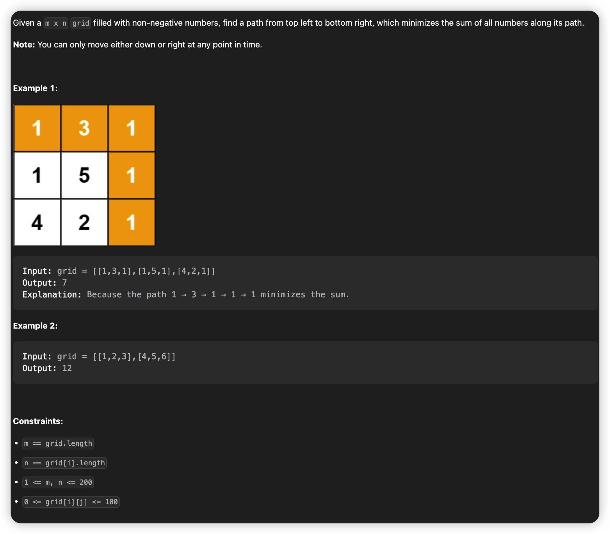

# March, 2023
|Mon|Tue|Wed|Thu|Fri|Sat|Sun|
|-|-|-|-|-|-|-|
|27|28|29|30|31|1|2|

## **Problem List**
|problemID|name|difficulty|lastChange|status|time complexity|beat|comment|recorded|
|-|-|-|-|-|-|-|-|-|
|64|Minimum Path Sum|Medium|03/27/2023|AC|O(m*n)|99%|DP|Y|
|310|Minimum Height Trees|Medium|03/27/2023|AC|O(n)|96%|Graph|Y|
|983|Minimum Cost For Tickets|Medium|03/28/2023|AC|O(n)|77%|dp|Y|
|322|Coin Change|Medium|03/28/2023|AC|O(n)|70%|dp|Y|

## 64. Minimum Path Sum
> DP AC 03/27/2023   



### **Solution**

* Typical dynamic programming problem, time complexity O(m * n), space complexity O(n).

### **Java**
```java {.line-numbers}
class Solution {
    public int minPathSum(int[][] grid) {
        int m = grid.length;
        int[] cur = grid[0];
        int n = cur.length;
        int[] pre = new int[n];
        for(int i = 1; i < n; ++i) {
            cur[i] += cur[i - 1];
            // System.out.println(cur[i]);
        }
        System.arraycopy(cur, 0, pre, 0, n);
        for(int i = 1; i < m; ++i) {
            cur[0] = pre[0] + grid[i][0]; 
            for(int j = 1; j < n; ++j) {
                cur[j] = pre[j] < cur[j - 1] ? pre[j] + grid[i][j] : cur[j - 1] + grid[i][j];
                // System.out.println(cur[j]);
            }
            System.arraycopy(cur, 0, pre, 0, n);
        }
        return cur[n - 1];
    }
}
```

## 310. Minimum Height Trees
> AC 03/27


### **Solution**
* The main thought is to trim leave nodes. After trimming most leaves, the 'core' remaining inside (1 or 2 points) is what we want. 
* The python version 1 has time complexity of O(n^2), nearly passes all testcases(70/71). Maybe quicker if optimized.
* The time complexity can be optimized using set() to replace list when recording the graph with adjacent list, like python version 2.
only O(n) now.

### Python Version 1
```python {.line-numbers}
class Solution:
    def findMinHeightTrees(self, n: int, edges: List[List[int]]) -> List[int]:
        if(n == 1): return [0]
        G = [[] for _ in range(n)]
        d = [0] * n
        for i in range(n - 1):
            a = edges[i][0]
            b = edges[i][1]
            d[a] += 1
            d[b] += 1
            G[a].append(b)
            G[b].append(a)

        rm = []
        remain = [True] * n
        while(True):
            for i in range(n):
                if(d[i] == 1):
                    rm.append(i)
                elif(d[i] == 0 and remain[i]):
                    rm.append(i)

            if(self.countRemain(remain) <= 2):
                return rm
            else:
                for node in rm:
                    d[node] -= 1
                    remain[node] = False
                    for x in G[node]:
                        d[x] -= 1
                rm = []
                
    def countRemain(self, remain) :
        sum = 0
        for x in remain:
            if(x): sum += 1
        return sum

```

### Python Version 2 [reference](https://leetcode.com/problems/minimum-height-trees/solutions/76055/share-some-thoughts/)
```python {.line-numbers}
class Solution:
    def findMinHeightTrees(self, n, edges):
        if n == 1: return [0] 
        adj = [set() for _ in range(n)]
        for i, j in edges:
            adj[i].add(j)
            adj[j].add(i)

        leaves = [i for i in range(n) if len(adj[i]) == 1]

        while n > 2:
            n -= len(leaves)
            newLeaves = []
            for i in leaves:
                j = adj[i].pop()
                adj[j].remove(i)
                if len(adj[j]) == 1: newLeaves.append(j)
            leaves = newLeaves
        return leaves
```

## 983. Minimum Cost For Tickets
> dp AC   

### **Solution**
A direct way is using recursion. However, it contains lots of duplicated calculation, like java version 1.
To apply the idea of dynamic planning, the key is designing array `dp`. Here `dp[i]` means the least cost to travel `i` days, which covers given days during `1` to `i`, specially `dp[0] = 0`. For example, if `days = [1]`, then `dp = [0,costs[0]]`.

### Java Version 1 (pass 26/69 TLE)
```java {.line-numbers}
class Solution {
    public int mincostTickets(int[] days, int[] costs) {
        if(days.length == 0) return 0;
        int bill1 = costs[0] + mincostTickets(Arrays.copyOfRange(days, getFrom(days, 1), days.length), costs);
        int bill2 = costs[1] + mincostTickets(Arrays.copyOfRange(days, getFrom(days, 2), days.length), costs);
        int bill3 = costs[2] + mincostTickets(Arrays.copyOfRange(days, getFrom(days, 3), days.length), costs);
        int bill = Math.min(bill1, Math.min(bill2, bill3));
        return bill;
    }

    public int getFrom(int[] days, int pass) { // pass = 1, 2, 3
        int n = days.length;
        int p = 0;
        if(pass == 1) {
            return 1;
        }else if(pass == 2) {
            while(p < n && days[p] < days[0] + 7) {
                ++p;
            }
            return p;
        }else {
            while(p < n && days[p] < days[0] + 30) {
                ++p;
            }
            return p;
        }
    }
}
```

### **Java Version 2** AC beat77%
```java {.line-numbers}
class Solution {
    public int mincostTickets(int[] days, int[] costs) {
        int n = days.length;
        int finalday = days[n - 1];
        int[] dp = new int[finalday + 1]; // dp[i] means the least cost to travel `i` days in the given list.
        dp[0] = 0;
        int pre = 0;
        for(int x : days) {
            for(int i = pre + 1; i < x; ++i) {
                dp[i] = dp[i - 1];
            }
            int bill1 = costs[0] + dp[x - 1];
            int bill2 = costs[1] + dp[Math.max(0, x - 7)];
            int bill3 = costs[2] + dp[Math.max(0, x - 30)];
            dp[x] = Math.min(bill1, Math.min(bill2, bill3));
            pre = x;
        }
        return dp[finalday];
    }
}
```

## 322. Coin Change
> dp AC 70% 03/28


## **Solution**
typical dp problem.

## **Java**
```java {.line-numbers}
class Solution {
    public int coinChange(int[] coins, int amount) {
        // coins = rearrangeCoins(coins);
        Arrays.sort(coins);
        int n = coins.length;

        // dp[i] means fewest number of coins to make up `i`, Integer.MAX_VALUE means impossible.
        int[] dp = new int[amount + 1]; 
        Arrays.fill(dp, Integer.MAX_VALUE);
        dp[0] = 0;
        for(int i = 1; i <= amount; ++i) {
            for(int j = 0; j < n; ++j) {
                int coin = coins[j];
                if(i - coin >= 0) {
                    if(dp[i - coin] != Integer.MAX_VALUE) {
                        dp[i] = Math.min(dp[i], dp[i - coin] + 1);
                    }
                }else {
                    break;
                }
            }
        }
        return dp[amount] == Integer.MAX_VALUE ? -1 : dp[amount];  
    }

    public int[] rearrangeCoins(int[] coins) {
        int n = coins.length;
        Set<Integer> set = new HashSet<>();
        for(int i = 0; i < n; ++i) {
            set.add(coins[i]);
        }
        int[] newCoins = new int[set.size()];
        int index = 0;
        for(int num : set) {
            newCoins[index++] = num;
        }
        Arrays.sort(newCoins);
        return newCoins;
    }
}
```