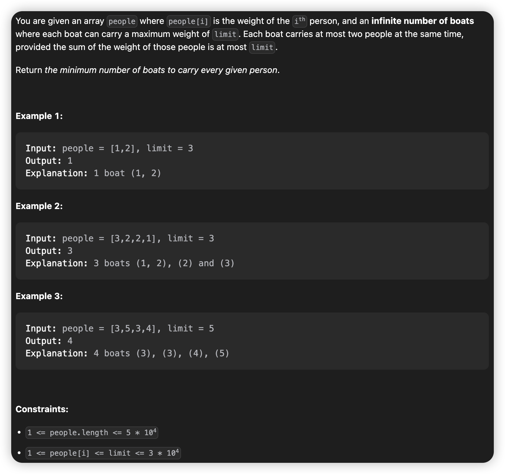
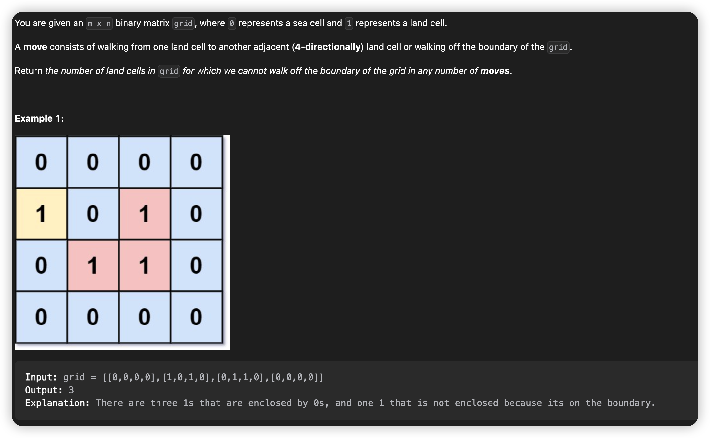
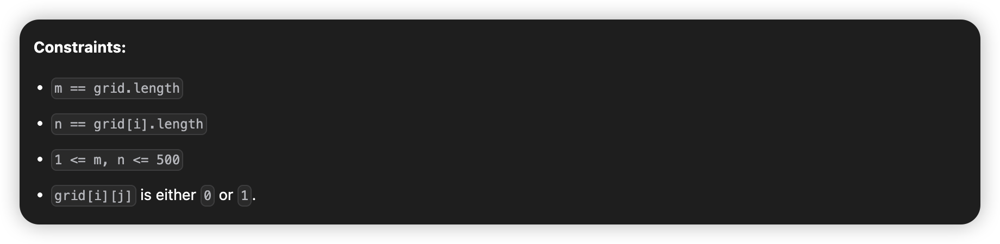

# April, 2023
|Mon|Tue|Wed|Thu|Fri|Sat|Sun|
|-|-|-|-|-|-|-|
|3|4|5|6|7|8|9|10|

# **Problem List**
|problemID|name|difficulty|lastChange|status|time complexity|beat|comment|recorded|
|-|-|-|-|-|-|-|-|-|
|881|Boats to Save People|Medium|04/03/2023|AC|O(nlogn)|98%|2 pointers, greedy, sort|Y|
|2439|Minimize Maximum of Array|Medium|04/05/2023|AC|O(n)|98%||N|
|1020|Number of Enclaves|Medium|04/09/2023|O(mn)|97%|DFS|Y|

# 881. Boats to Save People


## Solution

This is a typical problem of greedy algorithm. Use quicksort to sort the array, and save as much as you can in one boat.   
We use 2 pointers, one for `left = 0`, one for `right = people.length - 1`. Do while `left < right`, check if the heavy one(right) can carry a light one(left).   
Here why we combine the heaviest and the lightest together: Consider such case, `people = [1,3,4,5]`, `limit = 8`, surely we can combine `5 and 3`, `4 and 1` in 2 boats, but it means we can also combine `5 and 1`, `4 and 3` in 2 boats too. So it's number of people on one boat (1 or 2) we care first, then the sum of them.That's why we can always combine the heaviest and the lightest together, and still get the minimum num of boats.

## Java
```java {.line-numbers}
class Solution {
    public int numRescueBoats(int[] people, int limit) {
        int n = people.length;
        boolean[] saved = new boolean[n];
        // quicksort(people, 0, n);  
        Arrays.sort(people);
        // for(int i = 0; i < n; ++i) {
        //     System.out.println(people[i]);
        // }
        // System.out.println(getInsertionIndex(people, 3));
        int boats = 0;
        int l = 0;
        int r = n - 1;
        while(l < r) {
            int sum = people[l] + people[r];
            if(sum <= limit) {
                ++boats;
                ++l;
                --r;
            }else {
                ++boats;
                --r;
            }
        }
        
        return l == r ? boats + 1 : boats;
    }

    public void swap(int[] arr, int i, int j) {
        int temp = arr[i];
        arr[i] = arr[j];
        arr[j] = temp;
    }

    public void quicksort(int[] arr, int lo, int hi) {
        if(hi - lo <= 1) return;
        int mi = partition(arr, lo, hi);
        quicksort(arr, lo, mi);
        quicksort(arr, mi + 1, hi);
    }

    public int partition(int[] arr, int lo, int hi) {
        int mi = (int)((lo + hi) / 2);
        swap(arr, lo, mi);
        int pivot = arr[lo];
        hi--;
        while(lo < hi) {
            while(lo < hi && arr[hi] >= pivot) hi--;
            arr[lo] = arr[hi];
            while(lo < hi && arr[lo] <= pivot) lo++;
            arr[hi] = arr[lo];
        } // hi == lo
        arr[lo] = pivot;
        return lo;
    }

    // public int getInsertionIndex(int[] arr, int target) {
    //     int lo = 0;
    //     int hi = arr.length - 1;
    //     while(lo <= hi) {
    //         int mi = (int)((lo + hi) / 2);
    //         if(arr[mi] == target) {
    //             while(mi - 1 >= 0) {
    //                 if(arr[mi - 1] == target){
    //                     --mi;
    //                 }else{
    //                     break;
    //                 }
    //             }
    //             return mi;
    //         }else if(arr[mi] > target) {
    //             hi = mi - 1;
    //         }else {
    //             lo = mi + 1;
    //         }
    //     }
    //     return lo;
    // }
}
```

# 1020. Number of Enclaves




## Solution
DFS, deal with boundary cell first. 

## Java
```java {.line-numbers}
class Solution {
    public int numEnclaves(int[][] grid) {`
        int rows = grid.length;
        int cols = grid[0].length;
        for(int i = 0; i < rows; ++i) {
            dfs(grid, i, 0);
            dfs(grid, i, cols - 1);
        }
        for(int j = 0; j < cols; ++j) {
            dfs(grid, 0, j);
            dfs(grid, rows - 1, j);
        }

        int sum = 0;
        for(int i = 0; i < rows; ++i) {
            for(int j = 0; j < cols; ++j) {
                if(grid[i][j] != 0) {
                    ++sum;
                }
            }
        }
        return sum;
    }

    public void dfs(int[][] grid, int i, int j) {
        int rows = grid.length;
        int cols = grid[0].length;
        if(i < 0 || j < 0 || i >=rows || j >= cols || grid[i][j] == 0) {
            return;
        } 
        grid[i][j] = 0;
        dfs(grid, i, j - 1);
        dfs(grid, i, j + 1);
        dfs(grid, i - 1, j);
        dfs(grid, i + 1, j);
    }
}

```