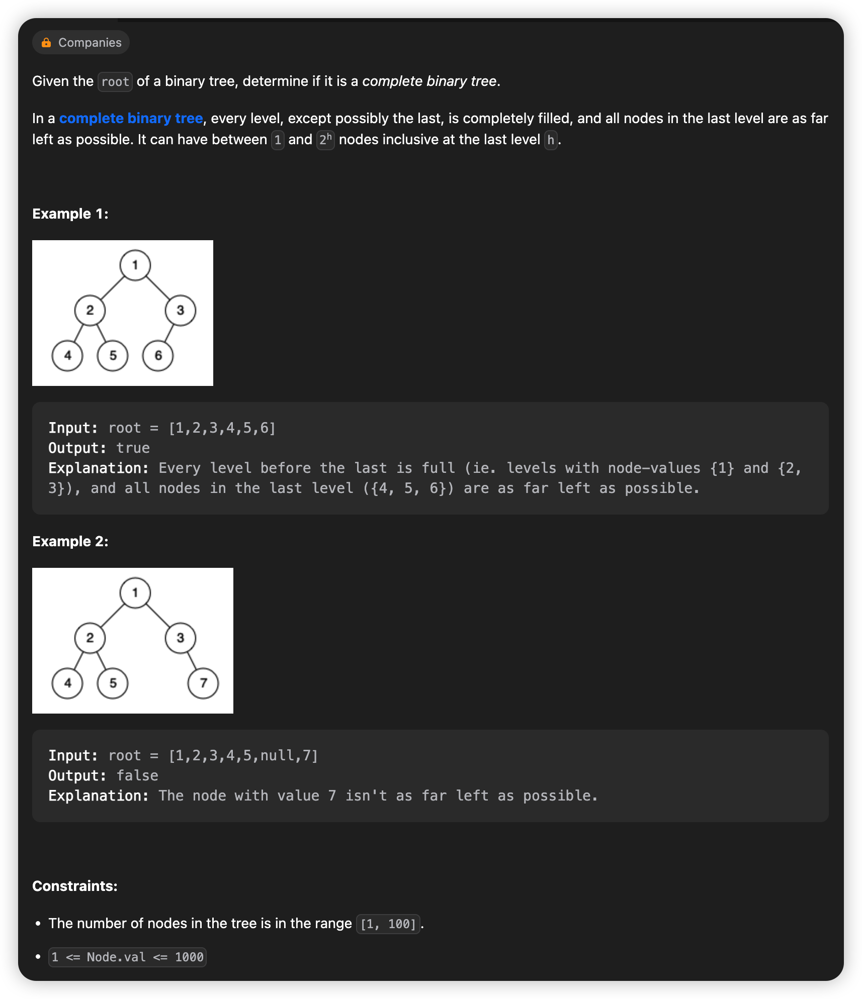
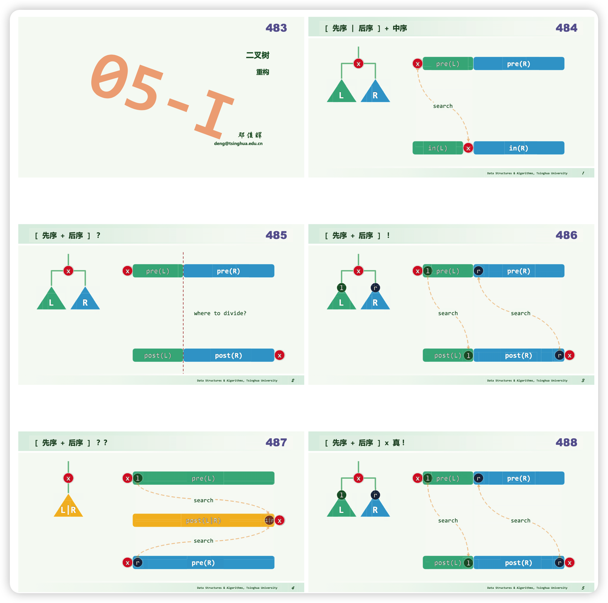
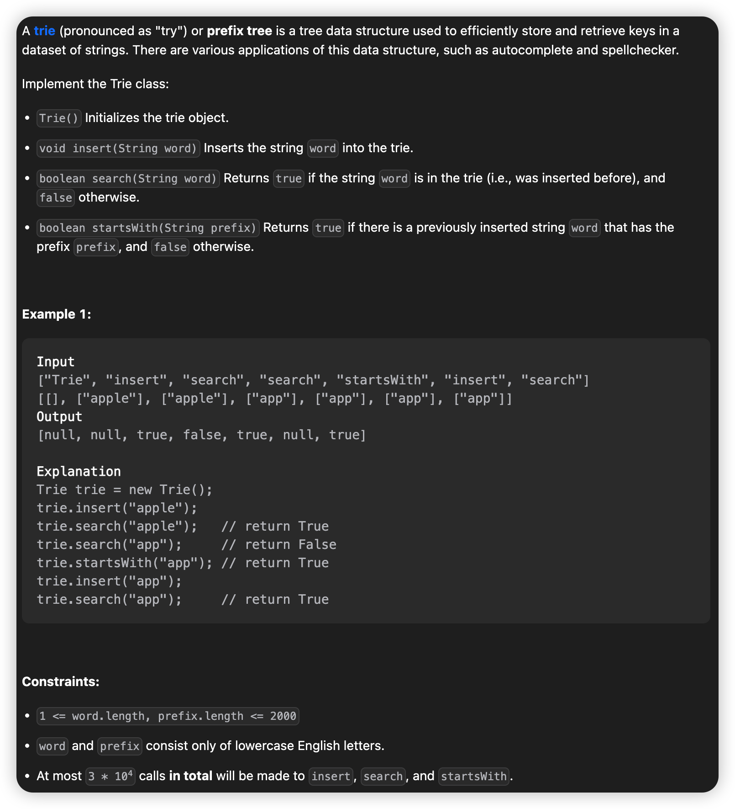
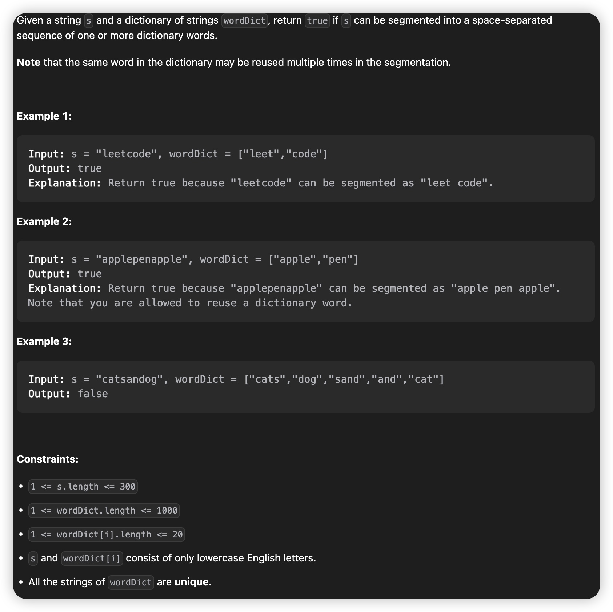
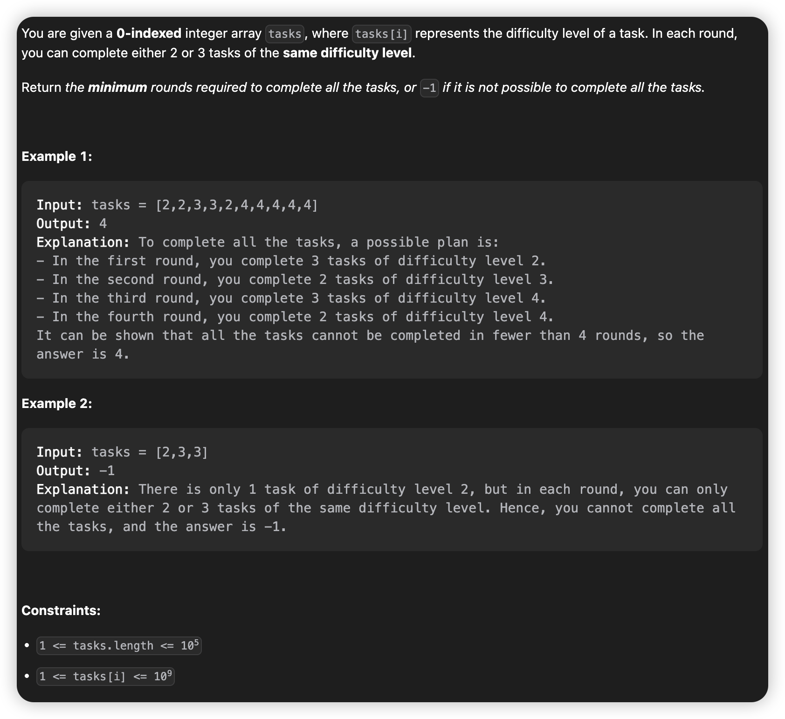
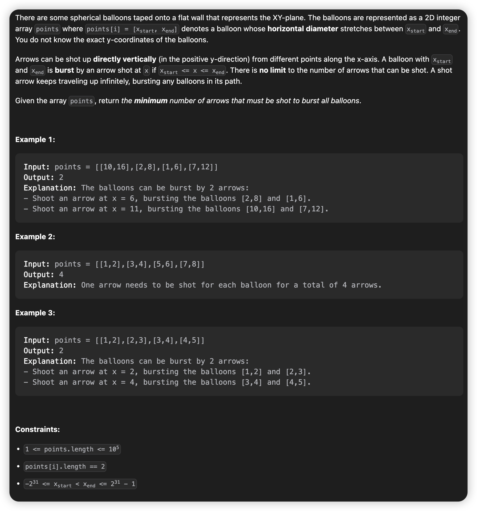

# March, 2023
## **Problem List**
|problemID|name|difficulty|lastChange|status|time complexity|beat|comment|recorded|
|-|-|-|-|-|-|-|-|-|
|958|Check Completeness of a Binary Tree|Medium|03/15/2023|AC|O(n)|91.2%|BFS in tree/deque. tranverse in level|Y|
|106|Construct Binary Tree from Inorder and Postorder Traversal|Medium|03/17/2023|AC|O(nlogn)|7.16%|tranverse in pre/in/post-order|Y|
|208|Implement Trie (Prefix Tree)|Medium|03/17/2023|AC||57.2%|Trie|Y|
|139|Word Break|Medium|03/17/2023|AC||27.2%|Trie or dp|Y|
|520|Detect Capital |Easy|03/17/2023|AC||99.4%||N|
|290|Word Pattern |Easy|03/17/2023|AC||89.9%|hashmap|N|
|944|Delete Columns to Make Sorted|Easy|03/17/2023|AC||96.7%||N|
|2244|Minimum Rounds to Complete All Tasks|Medium|03/17/2023|AC||25.3%|hashmap|Y|
|1472|Design Browser History|Medium|03/18/2023|AC||59.5%|LinkedList|N|
|452|Minimum Number of Arrows to Burst Balloons|Medium|03/18/2023|AC|O(nlogn)|7.62%|sort, intersection intervals|Y|
## 958. Check Completeness of a Binary Tree
> BFS deque  
> 03/15 Wed AC



### **Solution**
* Understand what is "complete binary tree", short as CBT.
* Understand BFS.
* Use BFS in the tree, if the node don't have a left/right child, just record the non-existent child as a "NULL Node" into BFS list--in this case we use deque.
* In BFS, if there is a "NULL Node" before any "not NULL Node", means the tree is not a CBT.
* so, when you met a "NULL Node", it means you can stop doing BFS and iterate through the deque. If you met a "not NULL Node", return False, or you iterate to the end and met no "not NULL Node", which means the tree is a CBT, so return True.
* why using deque, not queue.Queue?
    * when getting the 1st item in the queue, you have to pop it out, while sometime we just need to get access to it without popping it out.

### **Python3**
```python {.line-numbers}
# Definition for a binary tree node.
# class TreeNode:
#     def __init__(self, val=0, left=None, right=None):
#         self.val = val
#         self.left = left
#         self.right = right
class Solution:
    def isCompleteTree(self, root: Optional[TreeNode]) -> bool:
        if root == None:
            return True
        
        q = deque([root])
        
        while(q[0] is not None):
            n = q.popleft()
            q.append(n.left)
            q.append(n.right)
        
        while(bool(q) and q[0] is None):
            q.popleft()
        
        return not bool(q)
```
> 

### **Java**
```java {.line-numbers}
/**
 * Definition for a binary tree node.
 * public class TreeNode {
 *     int val;
 *     TreeNode left;
 *     TreeNode right;
 *     TreeNode() {}
 *     TreeNode(int val) { this.val = val; }
 *     TreeNode(int val, TreeNode left, TreeNode right) {
 *         this.val = val;
 *         this.left = left;
 *         this.right = right;
 *     }
 * }
 */
class Solution {
    public boolean isCompleteTree(TreeNode root) {
        if(root == null){
            return true;
        }

        Queue<TreeNode> q = new LinkedList<>(Arrays.asList(root));

        while(q.peek() != null){
            TreeNode node = q.poll();
            q.offer(node.left);
            q.offer(node.right);
        }

        while(!q.isEmpty() && q.peek() == null){
            q.poll();
        }

        return q.isEmpty();
    }
}
```

## 106. Construct Binary Tree from Inorder and Postorder Traversal
> Preorder Inorder Postorder   
> 03/17 Fri AC


### Solution
* preorder inorder postorder
* 'pre/post + in' can determine one tree
* 'pre + post' only **true** childtree on both side can dertermine one tree
* Prof.Deng has an illustration here.




### **Python3**
```python {.line-numbers}
# Definition for a binary tree node.
# class TreeNode:
#     def __init__(self, val=0, left=None, right=None):
#         self.val = val
#         self.left = left
#         self.right = right
class Solution:
    def buildTree(self, inorder: List[int], postorder: List[int]) -> Optional[TreeNode]:
        n = len(inorder)
        if(n == 0):
            return None
        elif(n == 1):
            return TreeNode(val=inorder[0])
        
        # The search process can be faster with Hashmap
        # with time complexity from O(n) to O(1).
        for i in range(n):
            if(postorder[-1] == inorder[i]):
                index = i
                break
        
        left = self.buildTree(inorder[:index], postorder[:index])
        right = self.buildTree(inorder[index+1:], postorder[index:n-1])
        root = TreeNode(inorder[i], left, right)
        return root
```

### **Java**
```java {.line-numbers}
/**
 * Definition for a binary tree node.
 * public class TreeNode {
 *     int val;
 *     TreeNode left;
 *     TreeNode right;
 *     TreeNode() {}
 *     TreeNode(int val) { this.val = val; }
 *     TreeNode(int val, TreeNode left, TreeNode right) {
 *         this.val = val;
 *         this.left = left;
 *         this.right = right;
 *     }
 * }
 */
class Solution {
    public TreeNode buildTree(int[] inorder, int[] postorder) {
        int n = inorder.length;
        if(n == 0) return null;
        if(n == 1) return new TreeNode(inorder[0], null, null);

        int index = 0;
        for(int i = 0; i < n; ++i){
            if(inorder[i] == postorder[n - 1]){
                index = i;
                break;
            }
        }

        TreeNode left = buildTree(Arrays.copyOfRange(inorder, 0, index), Arrays.copyOfRange(postorder, 0, index));
        TreeNode right = buildTree(Arrays.copyOfRange(inorder, index + 1, n), Arrays.copyOfRange(postorder, index, n - 1)); 
        TreeNode root = new TreeNode(inorder[index], left, right);
        return root;
    }
}

```

## 208. Implement Trie (Prefix Tree)
> Trie   
> 03/17 Fri   



### **Solution**
* Implement Trie
* Each connection between parent and its child represents a char.
* And each node means a word/prefix, the root means null.

### **Java**
```java {.line-numbers}
class TrieNode {
    TrieNode[] children;
    boolean isWord;
    public TrieNode(){
        this.isWord = false;
        this.children = new TrieNode[26];
    }
}

class Trie {
    TrieNode root;

    public Trie() {
        root = new TrieNode();
    }
    
    public void insert(String word) {
        TrieNode node = root;
        for(char c : word.toCharArray()){
            int index = c - 'a';
            if(node.children[index] == null){
                node.children[index] = new TrieNode();
            }
            node = node.children[index];
        }
        node.isWord = true;
    }
    
    public boolean search(String word) {
        TrieNode node = root;
        for(char c : word.toCharArray()){
            int index = c - 'a';
            if(node.children[index] != null){
                node = node.children[index];
            }else{
                return false;
            }
        }
        return node.isWord;
    }

    public boolean startsWith(String prefix) {
        TrieNode node = root;
        for(char c : prefix.toCharArray()){
            int index = c - 'a';
            if(node.children[index] != null){
                node = node.children[index];
            }else{
                return false;
            }
        }
        return true;
    }
}

/**
 * Your Trie object will be instantiated and called as such:
 * Trie obj = new Trie();
 * obj.insert(word);
 * boolean param_2 = obj.search(word);
 * boolean param_3 = obj.startsWith(prefix);
 */
```
or
```java {.line-numbers}
class Trie {
    HashSet<String> hs;
    public Trie() {
        hs=new HashSet<>();
    }
    
    public void insert(String word) {
        hs.add(word);
    }
    
    public boolean search(String word) {
        if(hs.contains(word))
            return true;
        return false;
    }
    
    public boolean startsWith(String prefix) {
        for(String it:hs){
            if(it.startsWith(prefix))
                return true;
        }
        return false;
    }
}
```

## 139. Word Break
> Trie or DP    
> 03/17 AC



### **Solution**
#### Trie
* With experience in 208, we can use a **TRIE** to save the wordDict, and mark node whether it's a word node.
* It's a recursive problem, if the prefix is a word in the wordDict, we just need to figure out whether the rest part can be broken or not.
* Notice that many situation(suffix) has been calculated for a lot of times. To reduce the complexcity, use an array to record whether a suffix is "***brokable***" or not.
#### Trie in Java
```java {.line-numbers}
class Solution {
    static boolean[] mem;

    public boolean wordBreak(String s, List<String> wordDict) {
        Trie t = new Trie();
        for(String word : wordDict){
            t.insert(word);
        }     
        mem = new boolean[300];
        for(int i = 0; i < 300; ++i){
            mem[i] = true;
        }
        return wordBreakTrie(s, 0, t);
    }

    public boolean wordBreakTrie(String s, int lo, Trie t){
        TrieNode node = t.root;
        int n = s.length();
        if(lo == n) return true;
        if(!mem[lo]) return false;
        for(int i = lo; i < n; ++i){
            int index = s.charAt(i) - 'a';
            if(node.children[index] == null){
                mem[i] = false;
                return false;
            }else{
                node = node.children[index];
                if(node.isWord && wordBreakTrie(s, i + 1, t)){
                    return true;
                }
            }
        }
        mem[lo] = false;
        return false;
    }
}

class TrieNode {
    TrieNode[] children;
    boolean isWord;

    public TrieNode(){
        this.isWord = false;
        this.children = new TrieNode[26];
    }
}

class Trie {
    TrieNode root;

    public Trie() {
        root = new TrieNode();
    }
    
    public void insert(String word) {
        TrieNode node = root;
        for(char c : word.toCharArray()){
            int index = c - 'a';
            if(node.children[index] == null){
                node.children[index] = new TrieNode();
            }
            node = node.children[index];
        }
        node.isWord = true;
    }

}
```
> 
#### Trie in Python3 ([Reference](https://blog.csdn.net/hgq522/article/details/121738516))
```python {.line-numbers}
class TrieNode:
    def __init__(self):
        self.end = False
        self.children = [False] * 26
        
class Solution:
    def wordBreak(self, s: str, wordDict: List[str]) -> bool:
        self.root = TrieNode()
        
        for word in wordDict:
            node = self.root
            for c in word:
                index = ord(c) - ord('a')
                if not node.children[index] :
                    node.children[index] = TrieNode()
                node = node.children[index]
            node.end = True
        
        mem = [True] * len(s)
        return self.helper(s, 0, mem)
    
    def helper(self, s, i, mem):
        if i == len(s):
            return True
        
        if not mem[i]:
            return False
        
        node = self.root
        for j in range(i, len(s)):
            idx = ord(s[j]) - ord('a')
            if not node.children[idx] :
                mem[i] = False
                return False
            node = node.children[idx]
            if node.end and self.helper(s, j + 1, mem):
                return True
        mem[i] = False
```

## 2244. Minimum Rounds to Complete All Tasks
> hashmap  
> 03/17/2023 AC



### **Solution**
* Well, it's all about HashMap ~

### **Java**
```java {.line-numbers}
class Solution {
    public int minimumRounds(int[] tasks) {
        HashMap<Integer, Integer> h = new HashMap<>(); //h(key=key, val=times)
        for(int num : tasks){
            if(h.get(num) == null){
                h.put(num, 1);
            }else{
                h.put(num, h.get(num) + 1);
            }
        }

        java.util.Collection<Integer> values = h.values();
        Iterator<Integer> iter = values.iterator();
        int rounds = 0;
        while(iter.hasNext()){
            int n = iter.next();
            if(n == 1){return -1;}
            if(n % 3 == 0){
                rounds += n / 3;
            }else{
                rounds += Math.ceil(n / 3) + 1;
            }
        }
        return rounds;
    }
}
```

## 452. Minimum Number of Arrows to Burst Balloons

> sort, intersection intervals   
> 03/18 AC O(nlogn)



### **Solution**

* The problem can be explained as finding several common intersections of given intervals, while each interval should be counted at least once, and return the minimum number of intersections.
* If two intervals have common intersections, use it to substitute these 2 intervals in the whole set won't change the minimum number of common intersections. So we can reduce the number of intervals and get closer to the final answer.
* However, choosing 2 intervals randomly to merge is not OK. One instinct way is to sort the intervals previously, for example, by x-start value in ascending order. Then we can merge 2 intervals into one.
* The rest part is easy.If 2 intervals cannot be merged, means you need to add 1 arrow. If they can be merged, substitute them with their common intersection and contiune.
* By the way, I use quicksort, the quickest way to sort an array in this situation.

### Java
```java {.line-numbers}
class Solution {
    public int findMinArrowShots(int[][] points) {
        int n = points.length;
        if(n == 1) {return 1;}
        quickSort(points, 0, n);
        // for(int i = 0; i < n; ++i) {
        //     System.out.println(points[i][0]);
        //     System.out.println(points[i][1]);
        // }
        int arrows = 0;
        int l = points[0][0];
        int r = points[0][1];
        for(int i = 1; i < n; ++i) {
            l = points[i][0];
            if(r < points[i][0]) {
                arrows++;
                r = points[i][1];
            }else {
                r = Math.min(points[i][1], r);
            }
        }
        arrows++;
        return arrows;
    }

    public void swap(int[][] points, int a, int b) {
        int[] temp = new int[2];
        temp = points[a];
        points[a] = points[b];
        points[b] = temp;
    }

    // sort by x-start, ascending
    public void quickSort(int[][] points, int lo, int hi) {
        if(hi - lo <= 1) return;
        int mi = partition(points, lo, hi);
        quickSort(points, lo, mi);
        quickSort(points, mi + 1, hi);
    }

    public int partition(int[][] points, int lo, int hi) {
        int pivot = points[lo][0];
        int pivot1 = points[lo][1];
        hi--;
        while(lo < hi) {
            while(lo < hi && points[hi][0] >= pivot) {hi--;}
            swap(points, lo, hi);
            // points[lo] = points[hi];
            while(lo < hi && points[lo][0] <= pivot) {lo++;}
            swap(points, lo, hi);
            // points[hi] = points[lo];
        }// lo == hi, break
        points[lo][0] = pivot;
        points[lo][1] = pivot1;
        return lo; 
    }
}
```