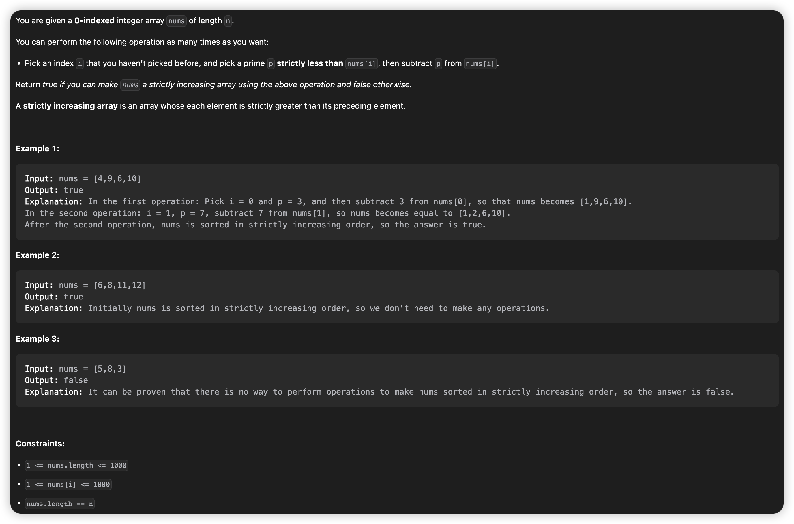

|problemID|name|difficulty|lastChange|status|time complexity|beat|comment|recorded|
|-|-|-|-|-|-|-|-|-|
|2600|K Items With the Maximum Sum|Easy||||||N|
|2601|Prime Subtraction Operation|Medium|03/27/2023|AC|O(n)|90.9%|greedy|Y|
|2602|Minimum Operations to Make All Array Elements Equal|Medium|03/27/2023|AC|O(n + m*logn)|99%|presum + binary search|Y|
|2603|Collect Coins in a Tree|Hard|03/27/2023|||||Y|

## 2601. Prime Subtraction Operation
> greedy AC O(n) 03/27/2023   



### **Solution**
Use greedy solution. Actually, to meet the requirement of strictly increasing, you should subtract the greatest prime which keeps the array strictly increasing orderly. To be short, from nums[0] on, for nums[i], subtract greatest prime while keeping nums[i] > nums[i - 1].

### **Java**
```java {.line-numbers}
class Solution {
    static int max = 1000;
    boolean[] primeList = new boolean[max]; // false - prime, true - not prime

    public boolean primeSubOperation(int[] nums) {
        generatePrimeList(max);
        int n = nums.length;
        if(n == 1) return true;
        nums[0] -= optimalPrime(0, nums[0]);
        for(int i = 1; i < n; ++i) {
            if(nums[i - 1] >= nums[i]) return false;
            int prime = optimalPrime(nums[i - 1], nums[i]);
            System.out.print("subprime" + prime + "\n");
            nums[i] -= prime;
        }
        return true;

    }

    public void generatePrimeList(int max) {
        primeList[0] = true;
        for(int i = 2; i < (int)(max / 2); ++i) {
            if(!primeList[i - 1]) {
                for(int j = 2 * i; j < max; j += i) {
                    primeList[j - 1] = true;
                }
            }
        }
    }

    public int optimalPrime(int pre, int cur) {
        int d = cur - pre;
        if(d <= 2) return 0;
        for(int i = d - 1; i > 1; --i) {
            if(!primeList[i - 1]) return i;
        }
        return 0;
    }
}
```

## 2602. Minimum Operations to Make All Array Elements Equal
> AC 03/27


### Solution
* Easy to have an idea like java version 1 below, it's brutal but exceeds time limit, though correct.
* Another thought is to find duplicated calculation in the steps. If we sort nums previously, than we can calculate the positive ones  together, negative ones likewise. And if we pre calculate the sum of the nums, we can reduce calculation further. That's why I use `presum`. And the version 2 was accepted with time complexity O(n + m*logn).

### Java Version 1 (pass 24/31, TLE)
```java {.line-numbers}
class Solution {
    public List<Long> minOperations(int[] nums, int[] queries) {
        int n = nums.length;
        int m = queries.length;
        long sum = (long)0;
        List<Long> ans = new LinkedList<>();
        for(int j = 0; j < m; ++j) {
            int query = queries[j];
            for(int i = 0; i < n; ++i) {
                sum += Math.abs(nums[i] - query);
            }
            ans.add(sum);
            sum = (long)0;
        }
        return ans;
    }
}
```

### Java Version 2 (AC beat 99%)
```java {.line-numbers}
class Solution {
    long[] presum;

    public List<Long> minOperations(int[] nums, int[] queries) {
        int n = nums.length;
        int m = queries.length;

        Arrays.sort(nums);
        // Arrays.sort(queries);
        
        presum = new long[n];
        presum[0] = (long)nums[0];
        for(int i = 1; i < n; ++i) {
            presum[i] = presum[i - 1] + (long)nums[i];
        }
        
        List<Long> answer = new LinkedList<>();
        // elem in nums[0,idx) <= query <= elem in nums[idx,n)
        for(int j = 0; j < m; ++j) {
            int query = queries[j];
            // System.out.print("query: " + query + "\n");
            int idx = getInsertIndex(nums, query); 
            // System.out.print("idx: " + idx + "\n");
            long ans = (long)0;
            if(idx == 0) {
                ans = presum[n - 1] - (long)(n) * (long)(query);
            }else if(idx == n) {
                ans = (long)(n) * (long)(query) - presum[n - 1];
            }else {
                //positive
                ans += (long)(idx) * (long)(query) - presum[idx - 1];
                //negative
                ans += (presum[n - 1] - presum[idx - 1]) - (long)(n - idx) * (long)(query);
            }
            answer.add(ans);
        }
        return answer;
    }

    public int getInsertIndex(int[] nums, int query) {
        int n = nums.length;
        if(query > nums[n - 1]) return n;
        int l = 0;
        int r = n;
        int m = (int) ((l + r) / 2);
        while(l <= r) {
            m = (int) ((l + r) / 2);
            if(query == nums[m]) {
                return m;
            }else if(query > nums[m]) {
                l = m + 1;
            }else {
                r = m - 1;
            }
        }
        return l;
    }
}
```

## 2603. Collect Coins in a Tree