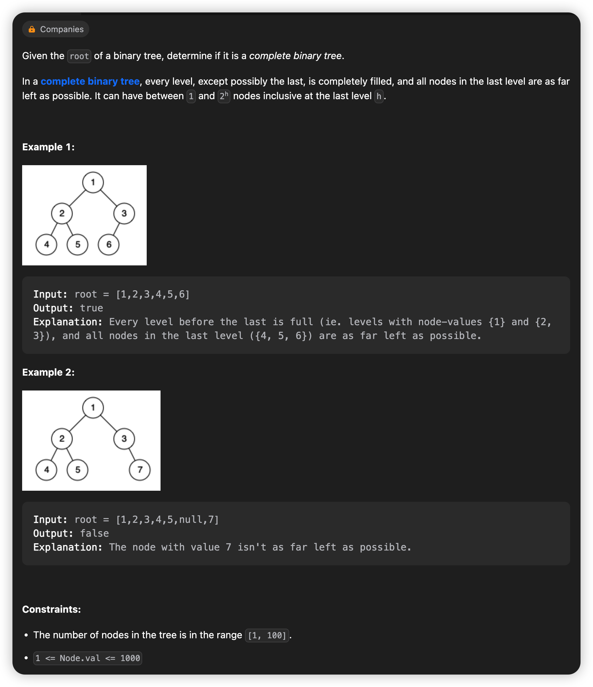
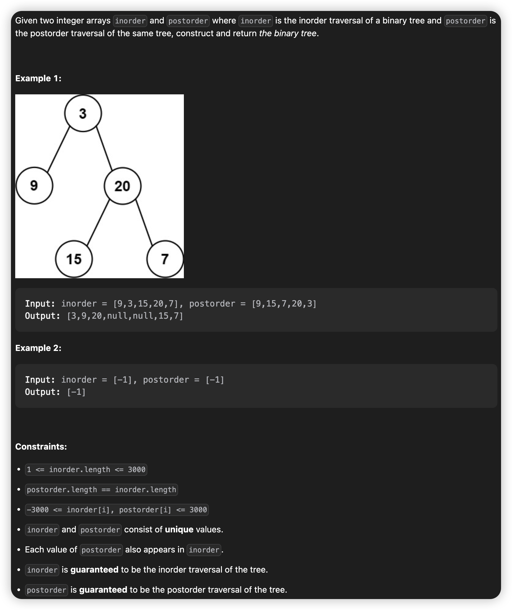

# March, 2023

## 958. Check Completeness of a Binary Tree
> BFS deque  
> 03/15 Wed AC



### **Solution**
* Understand what is "complete binary tree", short as CBT.
* Understand BFS.
* Use BFS in the tree, if the node don't have a left/right child, just record the non-existent child as a "NULL Node" into BFS list--in this case we use deque.
* In BFS, if there is a "NULL Node" before any "not NULL Node", means the tree is not a CBT.
* so, when you met a "NULL Node", it means you can stop doing BFS and iterate through the deque. If you met a "not NULL Node", return False, or you iterate to the end and met no "not NULL Node", which means the tree is a CBT, so return True.
* why using deque, not queue.Queue?
    * when getting the 1st item in the queue, you have to pop it out, while sometime we just need to get access to it without popping it out.

### **Python3**
```python {.line-numbers}
# Definition for a binary tree node.
# class TreeNode:
#     def __init__(self, val=0, left=None, right=None):
#         self.val = val
#         self.left = left
#         self.right = right
class Solution:
    def isCompleteTree(self, root: Optional[TreeNode]) -> bool:
        if root == None:
            return True
        
        q = deque([root])
        
        while(q[0] is not None):
            n = q.popleft()
            q.append(n.left)
            q.append(n.right)
        
        while(bool(q) and q[0] is None):
            q.popleft()
        
        return not bool(q)
```
> 

### **Java**
```java {.line-numbers}
/**
 * Definition for a binary tree node.
 * public class TreeNode {
 *     int val;
 *     TreeNode left;
 *     TreeNode right;
 *     TreeNode() {}
 *     TreeNode(int val) { this.val = val; }
 *     TreeNode(int val, TreeNode left, TreeNode right) {
 *         this.val = val;
 *         this.left = left;
 *         this.right = right;
 *     }
 * }
 */
class Solution {
    public boolean isCompleteTree(TreeNode root) {
        if(root == null){
            return true;
        }

        Queue<TreeNode> q = new LinkedList<>(Arrays.asList(root));

        while(q.peek() != null){
            TreeNode node = q.poll();
            q.offer(node.left);
            q.offer(node.right);
        }

        while(!q.isEmpty() && q.peek() == null){
            q.poll();
        }

        return q.isEmpty();
    }
}
```

## 106. Construct Binary Tree from Inorder and Postorder Traversal
> Preorder Inorder Postorder   
> 03/17 Fri AC



### Solution
* preorder inorder postorder
* 'pre/post + in' can determine one tree
* 'pre + post' only **true** childtree on both side can dertermine one tree
* Prof.Deng has an illustration here.


### **Python3**
```python {.line-numbers}
# Definition for a binary tree node.
# class TreeNode:
#     def __init__(self, val=0, left=None, right=None):
#         self.val = val
#         self.left = left
#         self.right = right
class Solution:
    def buildTree(self, inorder: List[int], postorder: List[int]) -> Optional[TreeNode]:
        n = len(inorder)
        if(n == 0):
            return None
        elif(n == 1):
            return TreeNode(val=inorder[0])
        
        # The search process can be faster with Hashmap
        # with time complexity from O(n) to O(1).
        for i in range(n):
            if(postorder[-1] == inorder[i]):
                index = i
                break
        
        left = self.buildTree(inorder[:index], postorder[:index])
        right = self.buildTree(inorder[index+1:], postorder[index:n-1])
        root = TreeNode(inorder[i], left, right)
        return root
```

### **Java**
```java {.line-numbers}
/**
 * Definition for a binary tree node.
 * public class TreeNode {
 *     int val;
 *     TreeNode left;
 *     TreeNode right;
 *     TreeNode() {}
 *     TreeNode(int val) { this.val = val; }
 *     TreeNode(int val, TreeNode left, TreeNode right) {
 *         this.val = val;
 *         this.left = left;
 *         this.right = right;
 *     }
 * }
 */
class Solution {
    public TreeNode buildTree(int[] inorder, int[] postorder) {
        int n = inorder.length;
        if(n == 0) return null;
        if(n == 1) return new TreeNode(inorder[0], null, null);

        int index = 0;
        for(int i = 0; i < n; ++i){
            if(inorder[i] == postorder[n - 1]){
                index = i;
                break;
            }
        }

        TreeNode left = buildTree(Arrays.copyOfRange(inorder, 0, index), Arrays.copyOfRange(postorder, 0, index));
        TreeNode right = buildTree(Arrays.copyOfRange(inorder, index + 1, n), Arrays.copyOfRange(postorder, index, n - 1)); 
        TreeNode root = new TreeNode(inorder[index], left, right);
        return root;
    }
}

```

## 208. Implement Trie (Prefix Tree)
> Trie   
> 03/17 Fri   


### **Solution**
* Implement Trie
* Each connection between parent and its child represents a char.
* And each node means a word/prefix, the root means null.

### **Java**
```java {.line-numbers}
class TrieNode {
    TrieNode[] children;
    boolean isWord;
    public TrieNode(){
        this.isWord = false;
        this.children = new TrieNode[26];
    }
}

class Trie {
    TrieNode root;

    public Trie() {
        root = new TrieNode();
    }
    
    public void insert(String word) {
        TrieNode node = root;
        for(char c : word.toCharArray()){
            int index = c - 'a';
            if(node.children[index] == null){
                node.children[index] = new TrieNode();
            }
            node = node.children[index];
        }
        node.isWord = true;
    }
    
    public boolean search(String word) {
        TrieNode node = root;
        for(char c : word.toCharArray()){
            int index = c - 'a';
            if(node.children[index] != null){
                node = node.children[index];
            }else{
                return false;
            }
        }
        return node.isWord;
    }

    public boolean startsWith(String prefix) {
        TrieNode node = root;
        for(char c : prefix.toCharArray()){
            int index = c - 'a';
            if(node.children[index] != null){
                node = node.children[index];
            }else{
                return false;
            }
        }
        return true;
    }
}

/**
 * Your Trie object will be instantiated and called as such:
 * Trie obj = new Trie();
 * obj.insert(word);
 * boolean param_2 = obj.search(word);
 * boolean param_3 = obj.startsWith(prefix);
 */
```
or
```java {.line-numbers}
class Trie {
    HashSet<String> hs;
    public Trie() {
        hs=new HashSet<>();
    }
    
    public void insert(String word) {
        hs.add(word);
    }
    
    public boolean search(String word) {
        if(hs.contains(word))
            return true;
        return false;
    }
    
    public boolean startsWith(String prefix) {
        for(String it:hs){
            if(it.startsWith(prefix))
                return true;
        }
        return false;
    }
}
```